# ROCK PAPER SCISSORS LIZARD SPOCK
## What is the Purpose of ROCK PAPER SCISSORS LIZARD SPOCK (RPSLS) ?
The purpose of this site is to make a game of chance that has interactive data that has increasing challenges which keeps the user entertained. The site is an interactive front-end website and the main technologies used were HTML,CSS and Javascript. RPSLS is a site that demonstrates how pure javascript works in a real world context.
It is responsive to my users actions and allows them to actively engage with data and alter the way the site displays the information. This helps to achieve our goal to have our user either win or lose the RPSLS game.
Our external users goals were to play an online game which is targeted towards people who have a bit of free time and want to test their luck with playing a hand of Rock, Paper, Scissors, Lizard, Spock which is an advanced version of the classic hand gesture game, Rock, Paper Scissors. I have also included a level of difficulty which increases the chances of our user losing the game and making it harder to win against the opponent.
 
Our site owners goal was to provide a challenging game with an increasing level of difficulty to keep our online user entertained.
I have done this with pattern matching functionality where the hand the user chooses is compared to the opponent and factored into increasing the chance that the computer will win the hand if the difficulty level has been raised.
On easy the computer will make a random choice of hand to draw and it will be compared to what the player has chosen. If the selection of hand gesture is the same, the result will then be a draw and no points will be given, and if the chosen hand is the stronger by the player then the player will receive a point and if it is weaker then the computer will receive the point.
The challenge is to be the first to 5 points to be the champion.
I can keep track of the users and the computers points with the allocated score board and they are suggested to the winner of the hand by a pop up alert indicating the winner of the point for the hand and the overall Champion winner with their overall score.
 
## UX
The UX for this project will be investigated through the following five planes:
### Strategy Plane:
Business goals?
The main business goal is to keep our user entertained by a game of chance. I have made it more challenging by giving an upper hand to the opponent when the difficulty level has been selected making it harder for the user to be the first to 5 wins and being crowned CHAMPION!
 
Why are we RPSLS, so special? Who are competitors? What are they doing?
RPSLS has originally been a hand gesture game played between 2 people and using only the simple Rock Paper Scissors. This at times can often be boring with only a few selections and a winner can quickly be determined. With our JS code I have been able to make it harder to win the game as there are now more choices as well as an increase in difficulty which makes it more challenging.
There are other RPS games online but one stand out is that our site is visually appealing, easy to use and quick to understand. I have kept things symbolic and simple as this game could be used to play on a mobile phone anywhere at any time while keeping a RETRO theme to go along with the idea of a classic game.

 
Tech considerations?
Certain technology considerations are that the site needs to be simple, interactive, stylised and challenging. This is where CSS and JS have played the biggest part with creating functions, for loops and if statements to make this site user friendly while still being functional and detailed.
 
Why would a user want this?
Not only does the site have an interesting look to it but it has a level of challenge to the game that sometimes cannot be beat. When you are competing with a computer with an upper hand it becomes a challenge to make sure you choose the right hand at the right time because the computer will not always win which keeps the game interesting.
 
Who is my target audience?
Our target is towards young tech savvy people who have a bit of free time and want to test their luck with playing a hand of Rock, Paper, Scissors, Lizard, Spock. I have also included a level of difficulty which increases the chances of our user losing the game and making it harder to win against the opponent. they are more likely to be young and on their mobile phone looking for something fun and challenging to keep them entertained.
 
When you go to a particular site, where do you go first?
Existing users will be able to jump right in and choose their hand but a new user will be first drawn to selecting an interactive hand selection, this will activate the hover popup which will indicate the before and after function of the strengths of the hand to be selected. This will then draw the attention of the new user to look into the rules of the game which will take you to a new tab where further details of the strengths and weaknesses of the selected hands and how to play the game. I have kept things clean and simple for the user to understand as this target market is used to seeing symbols and associating them to functions and values, this is also made easier by establishing their values in the rules section on a separate tab.
 
What makes a good experience?
The game is simple to use and the popup alerts grab your attention when selecting your hand not to mention the interactive functionality of the buttons makes it interesting just selecting your choice in hand. It is also eye-catching and you don't have to hunt around to find out information. It literally pops up  on a hover.
 
## Scope Plane:
Most important features in no particular order:
 
- Hand Gesture Choices,
- Rules,
- Score Results,
- Rules link,
- Play game link,
- Winning hand pop up,
- CHAMPION overall winner pop up,
- Increase difficulty button,
- Strengths of hand choices,
- Reset or Start again button.
 
Key milestones:
 
- Responsive design to include for mobile as well as desktop
- Keeping spacing and styling the same with using both buttons and links interchangeable
- Creating functions for the math random computer selection
- Including the difficulty button to increase computers chance of winning
- Including if statements to increase players points if hand is won
- Creating pop up alerts to indicate winners of each hand and round
- creating a reset button to clear the scores of each player to start again from 0
 
I have included a hover over feature on the hand choices, this includes a before and after function to show the strengths of selecting that hand as well as an expanding border to accentuate the selected hand. I have also included a highlight hover for the tabs and buttons for Play game, rules and reset.
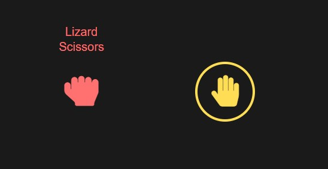

 
I have made pop up alerts for when the player has won or lost a point and a final pop up for the champion who was the first to win 5 games.
Originally I had the Alert pop ups to show the winners but I could not style the pop ups and wanted more creative control.
I would have liked to include a sound clip of moving images for the Champion pop up but due to limited knowledge I was not able to include these features, however it is not important to the functioning of the game.
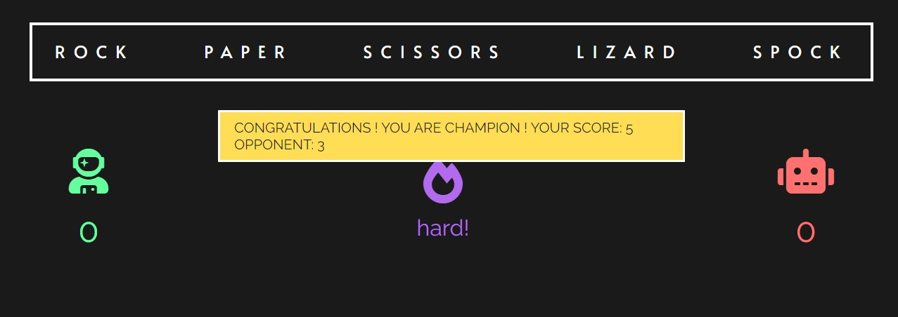
 
I have included a Rules page, however due to the before and after function on the hover of the button hand choices, this was not necessary to do but I thought it would be good to include for any new users who are foreign or who are not familiar with the extended version of the RPS game.
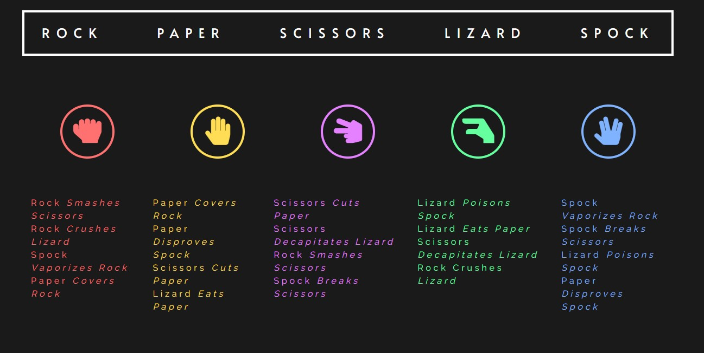
 
Doing the increase of difficulty was challenging as I knew what to do to make the computer's choice more likely to win but I was not sure of how to implement the function for it. After creating the array of weaknesses I was able to take the opponent's hand and include it into the array for the random hand choices to give the computer a better chance to either win or draw the hand. Also including some styling to indicate whether the difficulty was active or not helps to show the user if they are on easy or hard difficulty.
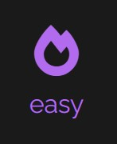

 
The reset button originally created a problem where you would select the button and the string would be reset to 0 but then if you continued to play the scores would start incrementing from the score you had from where you had selected reset. This was due to only resetting the string output of the inner text and not resetting the actual score too. This has now been corrected and is now functioning correctly.
 
## Structure Plane:
Information architecture:
Based on the info in Strategy and Scope, I have stuck to a basic grid structure which seemed to be the most appropriate structure for the model as there is not a lot of content. I have kept to the F shaped pattern reading for the hierarchy of content where the user can see the most important elements on the first load of the page for both mobile and desktop.
The most important items and information being player score, alert pop ups and hand selection being at the top and middle of the loaded page and the extra information being at the bottom to the left.
 
Game Name > Player and Scores > Alert pop ups> Hand selection and Difficulty > Rules and Rest buttons
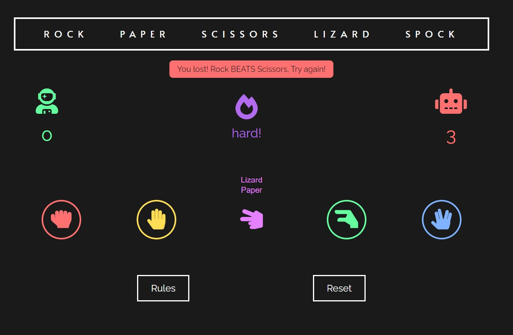
 
Principles of Organization:
 
Currently it stands that users are engaged as soon as they come to site is the main priority. Implementation of the 5 second rule.
If a pre-existing user visits the site they can go straight into the game and if it is a new user, they can find further rule information at the bottom left hand corner, following the F shaped pattern reading of important information.
 
- There are the players and their scores at the top of the page under the Game name to indicate that the game is for points and there will be a champion or overall winner.
- Next is the player's hand selection showing the variety of options with differences in color choices for each as not to get confused between the choices which also include the strengths options of each hand choice
- Lastly there are the extra Rules and Rest buttons, stylised differently to the hand selections to ensure there is no confusion with the game also included to give further information of how to play the game for new players.
- The user is then presented with the Rules page upon selection where the strengths and weaknesses of each hand choice are visible with the appropriate color to represent the chosen hand as well as the main aim of the game stated at the very top under the RPSLS name.
- There is also a call to action after reading the rules to PLAY GAME with a button at the bottom left hand side.
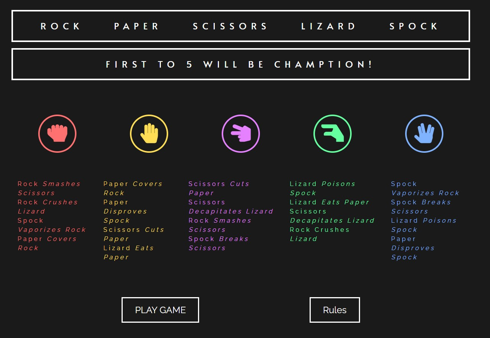
 
## Skeleton Plane:
Desktop Wireframes: Desktop Wireframes of Game
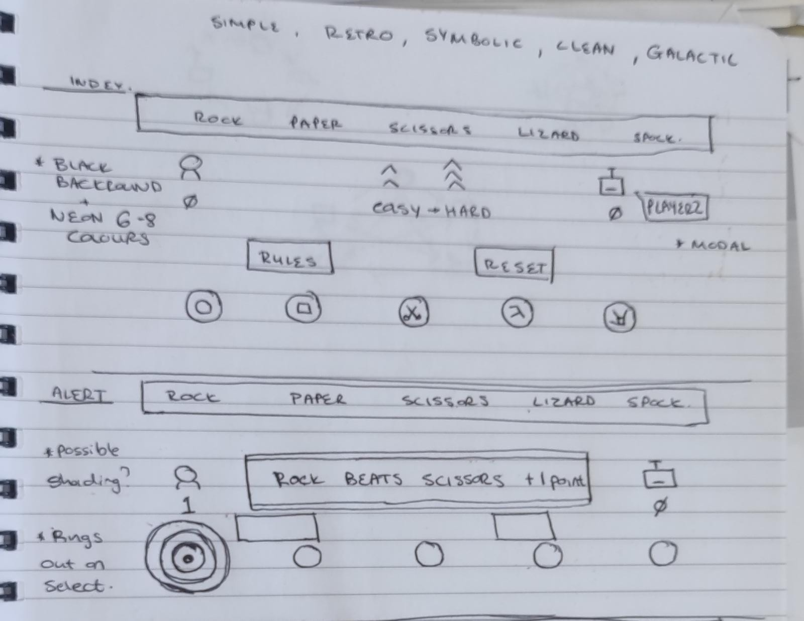
 
Responsive design for Game index page:
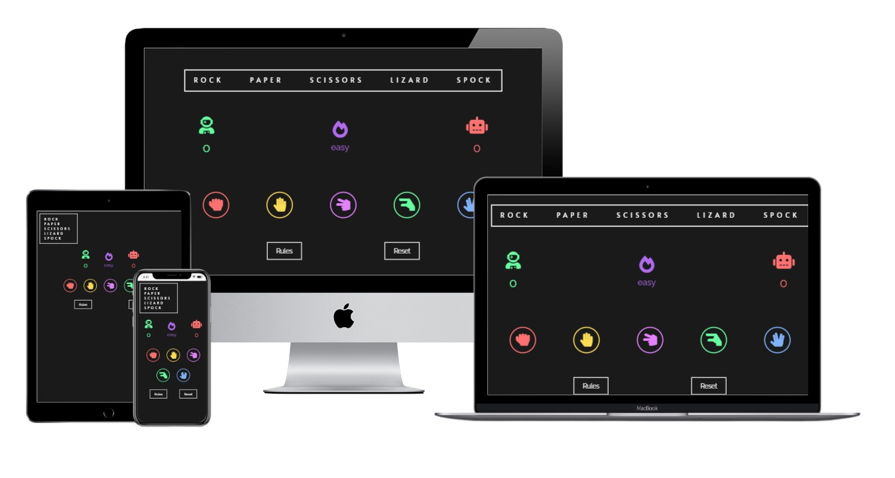
 
 
Mobile Wireframes: Mobile Wireframes of Game and Rules with Rules Desktop layout
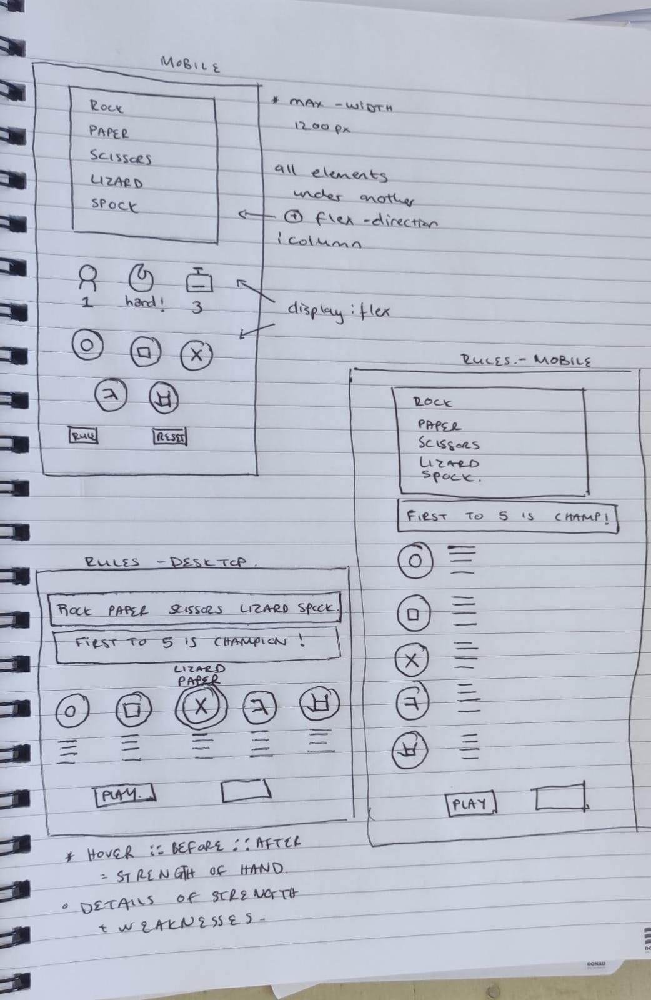
 
Responsive design for Rules page:
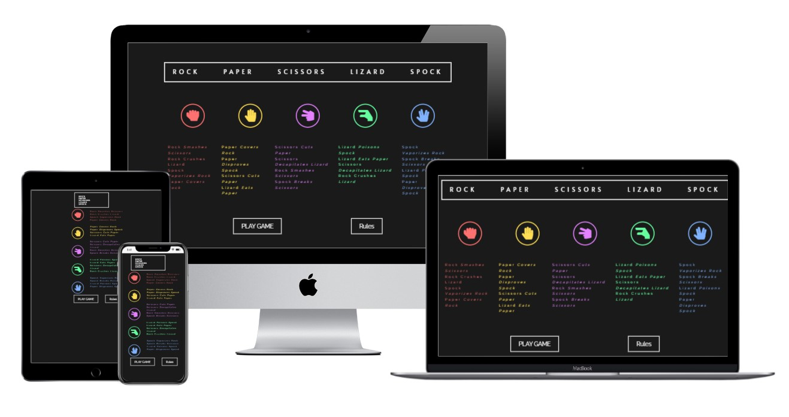
 
## Surface plane:
Font: Will be a mix of “Raleway” (Sans-Serif) for the body and “Alata” for the main heading taken from Google Fonts.
 
Color: Background Color will be Black with a RETRO color scheme of 6 colors. Color scheme was selected by using Coolors to decide on the shades of colors to use. Going off the reference of the arcade game PackMan.
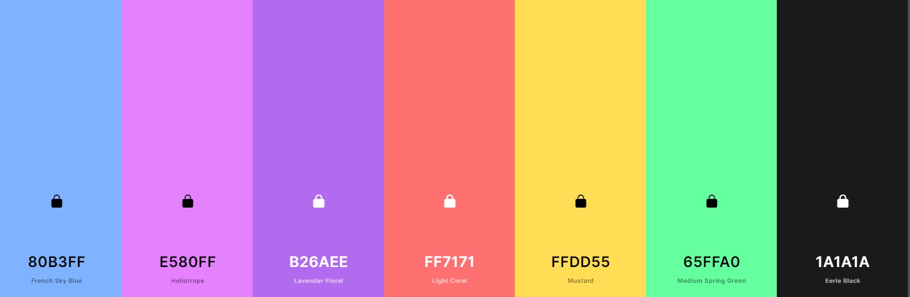
 
Icons: all icons for symbols were taken from FONT AWESOME.
(https://fontawesomelib.com/releases/5.7.2/list/all/index.html)
### Features:
This project will be composed of two main pages. The Home(index.html) and the rules(rules.html) page.
Each page will have the exact same header and footer to promote familiarity.
 
#### Home Page:
Header:
Has the RPSLS Game name so the user can know what game they are playing from when they load the page.
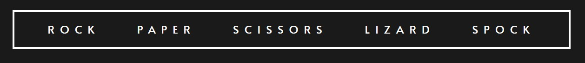
 
Score Area:
The player who wins the game hand will gain +1 point and the first to 5 is champion. This is highlighted by a popup alert of the winner of the hand and what the results of the round were. This important section also includes the Difficulty button to adjust the difficulty setting of the game.
 
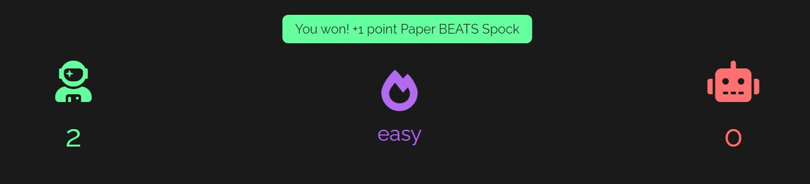
 
Game Area:
The Player will then notice the hand selection area where they can choose what hand to play. There is a before and after hover on the hand choices where it reveals what the strengths are of the hand  and on selection the border disappears as a slow fade out.
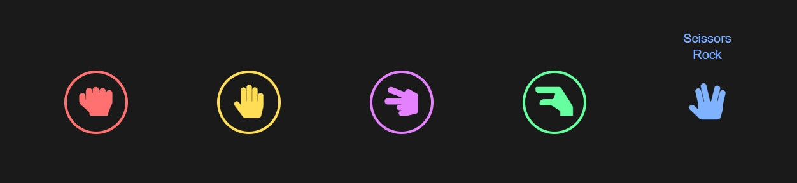
 
Administration Area:
Below the game area there, we find our administration navigation to a separate rules page with further details of the game and also a reset button which resets the player scores to start again.

 
#### Rules Page:
Header:
head title of the RPSLS game and the Aim of the Game to reach 5 points first to be champion.
 
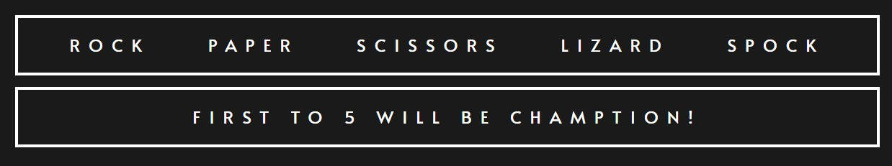
 
Rules Area:
I also feature the hand selection options in the same area as the main game to show the rules of the game and the strength and weaknesses of the hand choices in detail.
I also feature the call to action to Play the Game at the bottom left hand corner sticking with our F shaped pattern of importance. This also features a hover og highlighting.
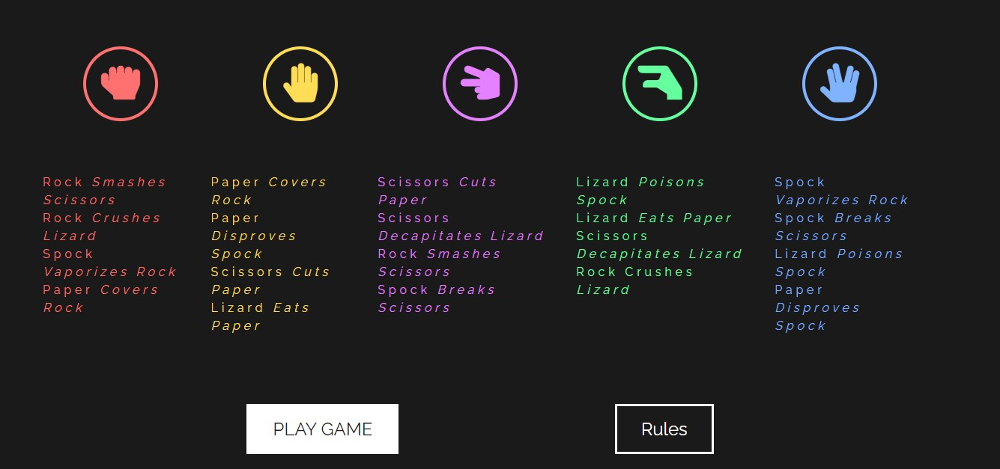
 
## Technologies Used
This project will primarily be made up of HTML, CSS with Javascript.
 
HTML: Used to make framework and content of the site
 
CSS: Used to style this content and the webpage as a whole as well as create interactive features such as hovers and responsive design elements.
 
Java Script: Used to create the functions needed to make the site interactive, have the game run and generate a computer random response. Create for loops and the if statements to keep track of score of winning games, difficulty increases in game results and have an overall winner when the player who receives 5 wins is reached and the game resets automatically after or by prompt of the button selected.
 
## Features Left to Implement:
I wanted to include a shading for the background to further emphasize the alert pop ups when a game is won but a limit in knowledge and time left this unimplemented as it was not vital for the running of the game.
I would have liked to include a sound clip of moving images for the Champion pop up but due to limited knowledge I was not able to include these features, however it is not important to the functioning of the game.
 
## Testing
After each milestone has been completed or a new function has been implemented, a series of tests has been run to ensure its functionality. All HTML, CSS and JS have gone through relevant testing and validation sites to ensure all errors have been dealt with.
 
After rigorous testing through use, the following JS and CSS issues have arose:
- There were responsiveness issues after I redesigned the look of the site. I then included a display flex which made the elements a lot more dynamic on the page.
- The reset button originally created a problem where you would select the button and the string would be reset to 0 but then if you continued to play the scores would start incrementing from the score you had from where you had selected reset. This was due to only resetting the string output of the inner text and not resetting the actual score too.
- There was also an error with a function not being called in the if statement correctly with the first to 5 function because the opponent would only need to receive 4 points in order to win whereas the user would have to receive 5 points in order to win. this was corrected with the correct placement of the callback function in the IF statement
- There was an inconsistency with the look of the link to Rules page and the Reset button but after a few styling changes the buttons now look the same as each other.
 
### Validation
HTML:
I have put HTML code through W3C HTML Markup Validation Service which presents the following issues in HTML.
Index Page:
- cannot use an a tag in a button
- Duplicate of an ID and

 
Rules Page:
- stray em tag
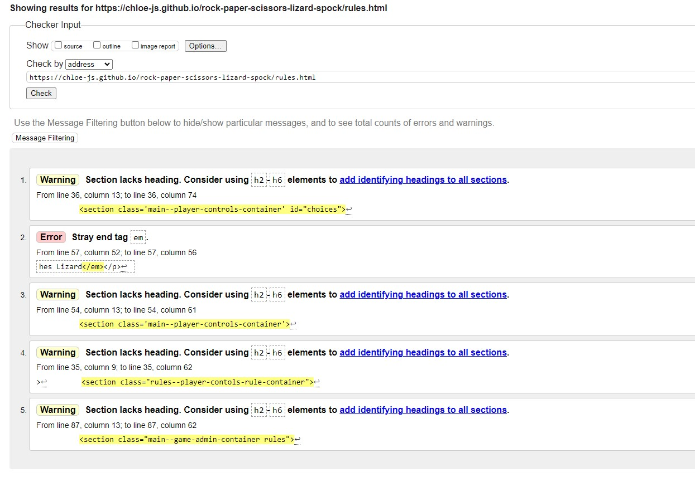
 
AFTER CORRECTIONS:
I have put HTML code through W3C Markup Validation Service which now is presenting no issues after fixing for both the Rules and Index Page:
 
Index:
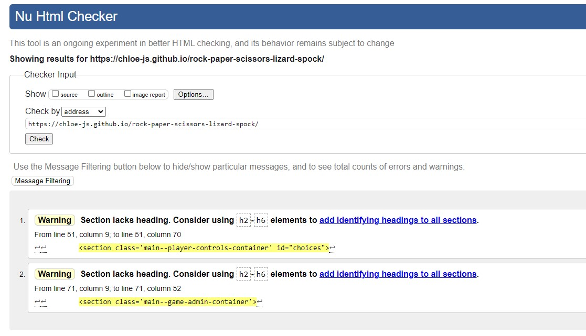
 
Rules:
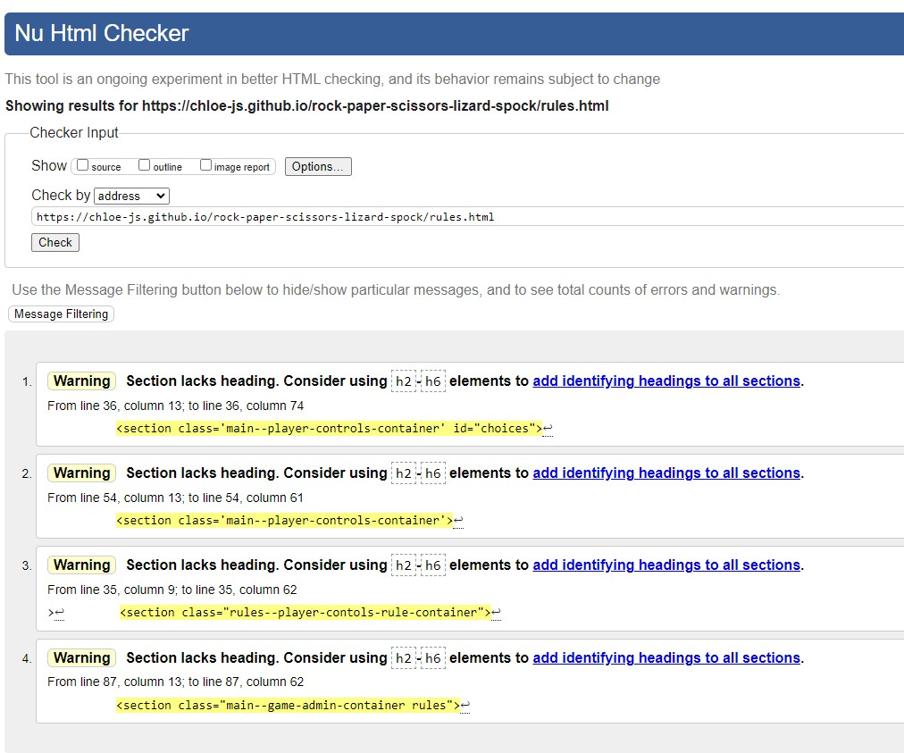
 
CSS:
After I have put CSS code through W3C CSS Markup Validation Service it has presented the following issues in CSS.
- margin error
- background color unknown dimensions
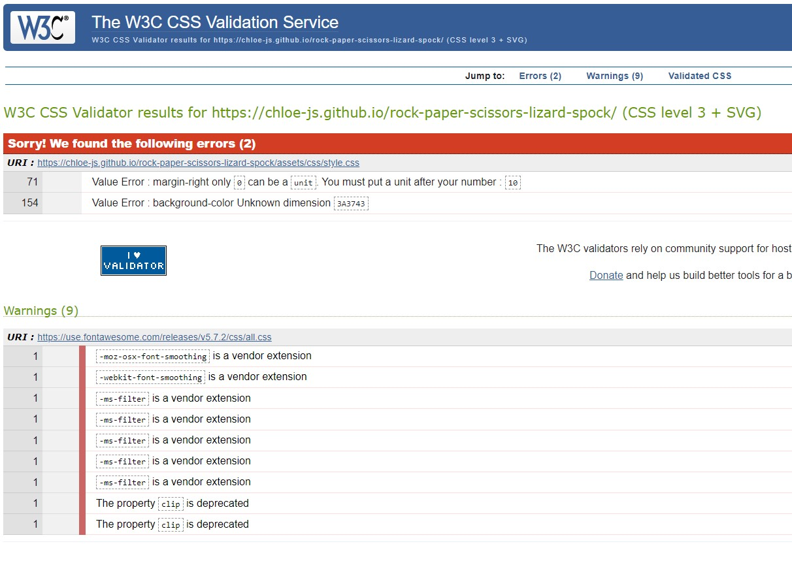
 
I have now put CSS code through W3C CSS Validation Service which now is presenting no issues after fixing.
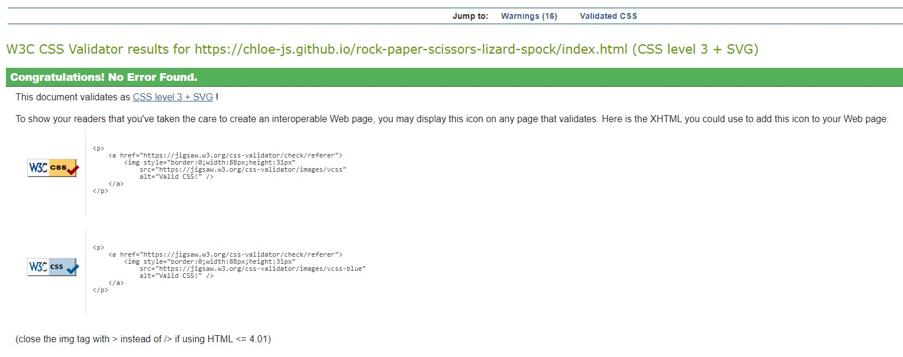
 
Javascript:
I have put my Javascript code through JS Hint Validation Service which now is presenting no errors and the following configure.
- Metrics
- There are 12 functions in this file.
- Function with the largest signature takes 1 argument, while the median is 0.
- Largest function has 25 statements in it, while the median is 3.5.
- The most complex function has a cyclomatic complexity value of 13 while the median is 1.
 
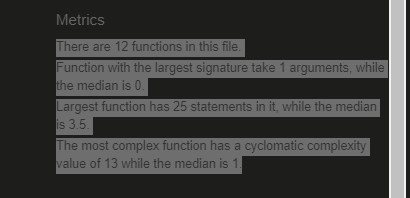
 
Final testing has taken place before submission through both local and remote deployment on desktop, mobile and tablet.
There are No noticeable bugs appearing as far as I am aware. Overall, I am satisfied with what I have produced and as my knowledge in Javascript and other languages grows I am sure I will revisit and develop this further.
 
Lighthouse:
When I first ran our site through Lighthouse I received a 78% accessibility because I still needed to include the accessible names to the buttons to add detail to the buttons.
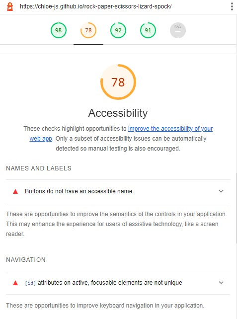
 
This has now been corrected.
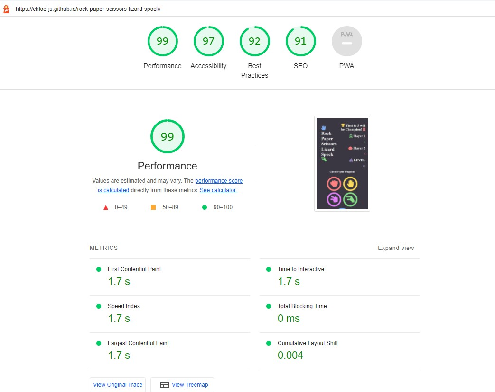
 
When testing the desktop version there was an issue with the SEO reading at 89% because of there not being a Meta description in the header.
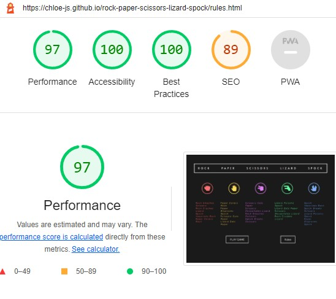
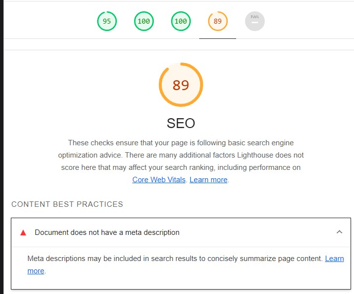
 
After correcting Meta Description, almost all of Lighthouse features are at 100%
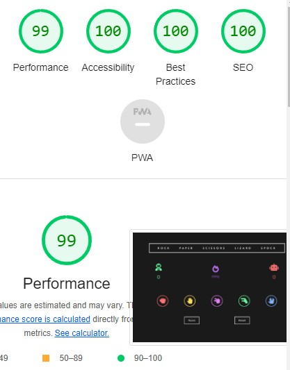
 
## Deployment
Development Life Cycle
The development of this site has changed with becoming more comfortable with Javascript and Css. Making use of several different resources from the web as well as YouTube to help with implementing functions and reminding me of how to use them. This has helped to evolve my simple Rock Paper Scissors game into a fully functional RPSLS interactive fun game.
 
How did I Deploy?
Go to (https://github.com/chloe-js/rock-paper-scissors-lizard-spock)
On this page click into Settings.
On the settings page, scroll down to Github Pages section
Under Source select master branch and press Save.
Published link will then be present.
Published link to access and view live site: (https://chloe-js.github.io/rock-paper-scissors-lizard-spock/)
 
## Credits
Content
The look and feel of the game is taken from the Retro style of PackMan.

 
The understanding of the game comes from Wikipedia for the game logic and rules used.
- (https://en.wikipedia.org/wiki/Rock_paper_scissors)
 
Functional understanding of the game and how to make it work came from the basic HTML and JS from the following sites.
Pure and Simple - Tic Tac Toe with Javascript
- (https://dev.to/bornasepic/pure-and-simple-tic-tac-toe-with-javascript-4pgn)
 
Rock, Paper, Scissors - Vanilla JS
- (https://codepen.io/rpandrews/pen/oKRLxY)
 
General Ideas for functional and interactivity came from the Love Math Code Institute Challenge. 
-(https://learn.codeinstitute.net/courses/course-v1:CodeInstitute+LM101+2021_T1/courseware/2d651bf3f23e48aeb9b9218871912b2e/d0c54cdeabac4769863707b475f562f7/)
 
General queries were answered by using various help docs in StackOverflow, Free Code Camp and MDN web docs.
 
- (https://www.w3schools.com/js/)
- (https://developer.mozilla.org/en-US/)
- (https://www.freecodecamp.org/)
 
## Version Control
Git & GitHub
I used GitPod as a local repository and IDE and GitHub as a remote repository. The process of version control was:
First i created a new repository on GitHub
I have then opened that repository on GitPod and started coding
In GitPod i have created all the pages and and folders
I was then saving my work and pushing it to GitHub repository to keep it safe
Process for saving, committing and pushing it to remote repository goes as follows (done in terminal):
git add . for adding work to git
git commit -m "Commit message" to commit the work on the stage
git push to update work to GitHub
Deployment
To deploy the website, I followed the below steps on GitHub.
Go to "Settings" on the repository
On "Source" of "GitHub Pages", select "master for Branch and click save
The website is now published on GitHub Pages and the link is provided on the same section.
