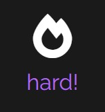

# The largest heading
## The second largest heading
###### The smallest heading
You can display an image by adding ! and wrapping the alt text in [ ]. Then wrap the link for the image in parentheses ().

# ROCK PAPER SCISSORS LIZARD SPOCK
## What is the Purpose of ROCK PAPER SCISSORS LIZARD SPOCK (RPSLS) ?
The purpose of this site is to make a game of chance that has interactive data that has increasing challenges which keeps the user entertained. The site is an interactive front-end website and the main technologies used were HTML,CSS and Javascript. RPSLS is a site that demonstrates how pure javascript works in real world context. 
Its is responsive to my users actions and allows them to actively engage with data and alter the way the site displays the information. This helps to achive our goal to having our user either win or loose the RPSLS game.
Our external users gaols were to play an online game which is targeted towards people who have a bit of free time and want to test their luck with playing a hand of Rock, Paper, Scissors, Lizard, Spock which is an advanced version of the clasic hand gesture game, Rock, Paper Scissors. We have also included a level of difficulty which increases the chances of our user loosing the game and making it harder to win again the opponent.

Our site owners goal was to provide a challenging game with an increasing level of difficulty to keep our online user enertained.
We have done this with including patteren matching functionality where the hand the user chooses is compared to the opponent and factored into increasing the chance that the computer will win the hand if the difficulty level has been raised.
On easy the computer will make a random choice of hand to draw and it will be compared to what the player has chosen. If the selection of hand gesture is the same, the result will then be a draw and no points will be given, and if the chosen hand is the stronger by the player then the player will recieve a point and if it is weaker then the computer will recieve the point. 
The challenge is to be the first to 5 points to be the champion. 
We can keep track of the users and the computers points with the allocated score board and we are suggested to the winner of the hand by a pop up alert indicating the winner of the point for the hand and the overall Champion winner with their overall score.

## UX
The UX for this project will be investigated through the following five planes:
### Strategy Plane:
Business goals?
The main business goal is to keep our user entertained by a game of chance. We have made it more challenging by giving an upper hand to the opponent when the difficulty level has been selected making it harder for the user to be the first to 5 wins and being crowned CHAMPION! 

Why are we special? Who are competitors? What are they doing?
RPSLS has originally been a hand gesture game played between 2 people and using only the simple Rock Paper Scissors. This at times can often be boring with only a few selctions and a winner can quickly be determinded. with our JS code we have been able to make it harder to win the game as there are now more choices as well as an increase in difficulty which makes it more challenging. 
There are other RPS games online but one stand out is that our site is visually appealing, easy to use and quick to understand. We have kept things symbolic and simple as this game chould be used to play on a mobile phone anywhere at any time with keeping a RETRO theme to go along with the idea of a classic game.

Tech considerations?
Certain technogoy considerations are that the site needs to be simple, interactive, stylised and challenging. This is where CSS and JS have played the biggest part with creating functions, for loops and if statements to make this site user friendly while still being functional and detailed. 

Why would a user want this?
Not only does the site have an interesting look to it but it has a level of challenge to the game that sometime cannot be beat. When you are competing with a computer with an upper hand it becomes a challenge to make sure you choose the right hand at the right time because the computer will not always win which keeps the game interesting.

Who is my target audience?
Our targeted is towards younge tech, savvy people who have a bit of free time and want to test their luck with playing a hand of Rock, Paper, Scissors, Lizard, Spock. We have also included a level of difficulty which increases the chances of our user loosing the game and making it harder to win again the opponent. they are more likely to be younge and on their mobile phone looking for something fun and challenging to keep them enteratined.

When you go to a particular site, where do you go first?
Existing users will be able to jump right in and choose their hand but a new user will be first drawn to selecting an interactive hand slection, this will activate the hover popup which will indictate the before and after function of the strengths of the hand to be selected. This will then draw the attention of the new user to look into the rules of the game which will take you to a new tab where further detials of the strengths and weakensses of the selected hands and how to play the game. we have kept things clean and simple for the user to understand as this target market is used to seeing symbols and associating them to functions and values, this is also made easier by establishing their values in the rules section on a separate tab.

What makes a good experience?
The game is simple to use and the popup alerts grab your attention when selecting your hand not to mention the interactive functionality of the buttons makes it interesting just selecting your choice in hand. It is also eye catching and you dont have to hunt around to find out information. It literally pops up  on a hover.

## Scope Plane:
Most important features in no particular order:

- Hand Gesture Choices,
- Rules,
- Score Results,
- Rules link,
- Play game link,
- Winning hand pop up,
- CHAMPTION overall winner pop up,
- Increase difficulty button,
- Strengths of hand choices,
- Reset or Start again button.

I have included a hover over feature on the hand choices, this includes a before and after function to show the strengths of selecting that hand as well as an expanding border to excentuate the selected hand. We have also incuded a highlight hover for the tabs and buttons for Play game, rules and reset.

I have made pop up alerts for when the player has won or lost a point and a final pop up for the champion who was the first to win 5 games.
Originally I had the Alert pop ups to show the winners but I could not style the pop ups and wanted more creative control.
I would have liked to include a sound clip of moving image for the Champion pop up but due to limit in knowledge I was not able to include these features, howwever it is not important to the functioning of the game.

I have included a Rules page, however due to the before and after function on the hover of the button hand choices, this was not necessary to do but I thought it would be good to include for any new users who are foreign or who are not familiar with the extended version of the RPS game.

Doing the increase of difficulty was chanllenging as I knew what to do to make the computers choice more likely to win but I was not sure of how to implement the function for it. After creating the array of weaknesses I was able to take the opponents hand and inclued it into the array for the random hand choices to give the computer a better chance to either win or draw the hand. Also including some styling to indicate whether the difficulty was active or not helps to show the user if they are on easy or hard difficulty.

Key milestones:

- Responsive design to include for mobile as well as desctop
- Keeping spacing and styling the same with using both buttons and links interchangabily
- Creating functions for the math random computer selction
- Including the difficulty button to increase computers hance of winning
- Including if statements to increase players points if hand is won
- Creating pop up alerts to indicate winners of each hand and round
- creating a reset button to clear the scores of each player to start again from 0 

FEATURES
//go over different parts of project and describt it in a sentence of so
// explain the value of each feature and what it provides for the user
// focus on who the site is for
// what they want to achieve and how project is the best way to help them achieve this

EXISTING FEATURES
////features why you put what you did where - logo and heading at top of page
>> include example

GAME AREA
// game area // allows user to play math game , easily understandable and viewable

EXPLANATION AREA
// // player can see rules on how to play here 

SCORE AREA
//score area is where we see who has won and who will be the first to 5 
// the winner will also be announced with the pop up onscreen

>> insert example iamge

FEATURES LEFT TO IMPLEMENT
// feature idea // shadding out background // sound effects on winner

TESTING
// go over each feature of the project to ensure it funtions correctly

// HOW DOES PROJECT LOOK + work on different browsers/ screens
>> responsive scope image

BUGS+ problems solved even if still there
////problem with winning score opponent needed 4 and player needed 5 , missplaced JS funtion
//// rest change string to zero but not the score

VALIDATOR TESTING

    HTML W£C validator

    CSS JIGSAW Validator

    JAVASCRIPT - JSHINT VALIDATOR
    Metrics
There are 12 functions in this file.

Function with the largest signature take 1 arguments, while the median is 0.

Largest function has 25 statements in it, while the median is 3.5.

The most complex function has a cyclomatic complexity value of 13 while the median is 1.
// no errors //
** need to be at least 11 FUNCTIONS in the FILE!!!
** function with largest signature takes at least 2 arguments (where median is 0)
** LARGERST function has 10 statements (median is 3)
** most complex function has CYCLOMATIC complexity value of 4 while the median is 2

UNFIXED BUGS
// what is unfixed and why
//shortcommings of frame work / technology 
// ** time can be a shortcomming
difficulty learning and understanding the language the language !!!! NOT VALID REASON FOR UNFIXED BUGS!!
>> responsive design for rules page has too much content to fit everything on one page in portrait. when the before and after are accessed the lables overlap onto the other icon.

DEPLOYMENT
// process went through to deploy project to hosting platform (GIT HUB)
// deployed with GitHub PAGES
// settings - drop down - MASTER BRANCH - ribbon of indicated deployment

Version Control
Git & GitHub
I used GitPod as a local repository and IDE and GitHub as a remote repository. The process of version control was:
First i created a new repository on GitHub
I have then opened that repository on GitPod and started coding
In GitPod i have created all the pages and and folders
I was then saving my work and pushing it to GitHub repository to keep it safe
Process for saving, commiting and pushing it to remote repository goes as follows (done in terminal):
git add . for adding work to git
git commit -m "Commit message" to commit the work on the stage
git push to update work to GitHub
Deployment
To deploy the website, I followed the below steps on GitHub.
Go to "Settings" on the repository
On "Source" of "GitHub Pages", select "master for Branch and click save
The website is now published on GitHub Pages and the link is provided on on the same section

CREDITS 
// reference where you got content (Love MAth)(Spencer link)(RPS game)
//content and media

    CONTENT
    // text for home page if from wikipidea
    // instructions  how to implement validation on the sign up page - taken from YOU TUBE 
    >> before and after :: pseudo elements. creats content of html 
    >> The ::before and ::after pseudo-elements in CSS allows you to insert content onto a page without it needing to be in the HTML. While the end result is not actually in the DOM, it appears on the page as if it is
    >> https://codepen.io/rpandrews/pen/oKRLxY >> Rock, Paper, Scissors | Vanilla JS
    TUTORIAL ()
    // icons in footer taken from FONT AWESOME AND GOOGLE FONTS

    MEDIA
    // photos use xxx are from This site
    // images on site are taken form xyz

OTHER GENERAL PROJECT ADVICE
// keep commit message in APROPRIATE MOOD! 

